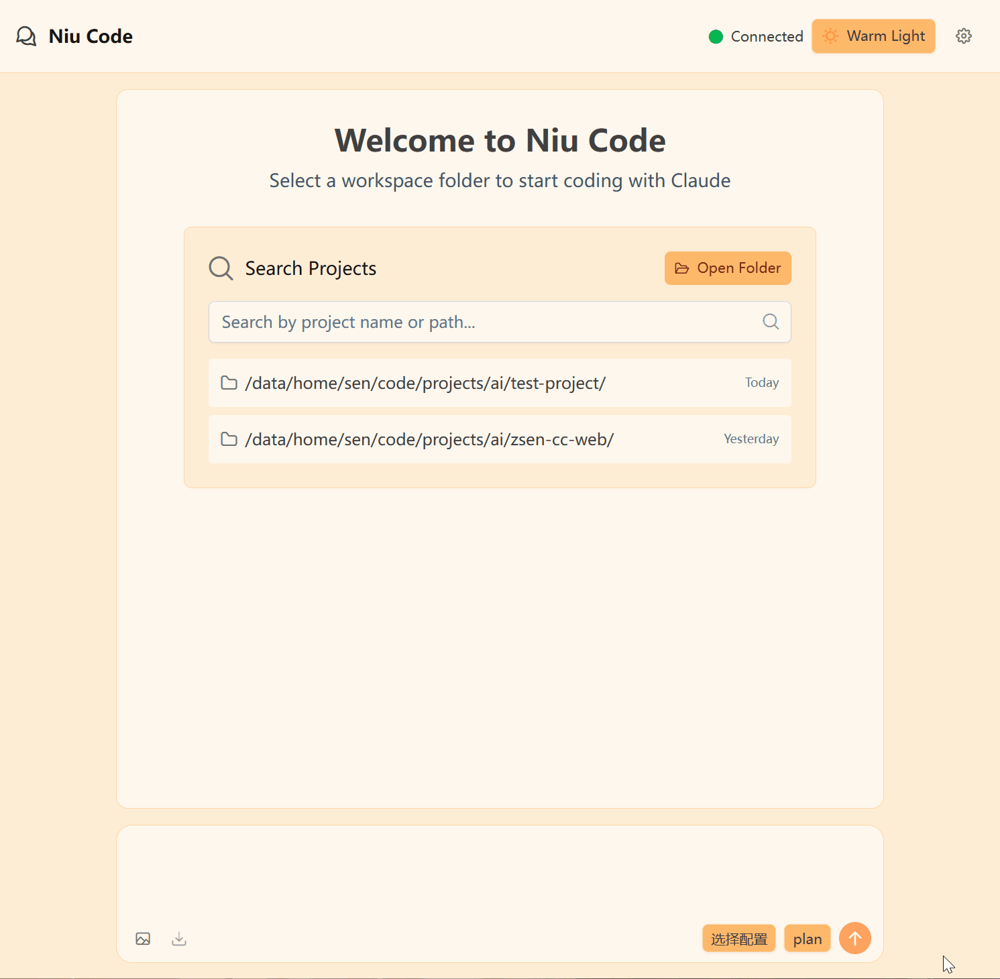

# Niu Code

为 Claude Code CLI 提供现代化的 Web 界面，并复刻了你喜爱的大部分便捷操作，带来比命令行更好的交互体验。

## 功能特性

- **UI**: 基于 Vue 3 构建简洁直观的界面，支持切换主题配色
- **高级编辑器**: 基于 TipTap 的输入框，实时渲染 Markdown 文本
- **便捷操作**：niu code 复刻了 Claude Code Cli 大部分便捷操作
  - 权限模式，如 Plan，acceptEdits
  - Slash command，包括自定义命令
  - @ 文件引用补全
  - 输入框粘贴图片
  - CTRL + R 查找历史提示词
- **服务化的会话**
  - 你可以随时关闭网页，让 Claude 在后台为你工作（这是本项目名字的出处）
  - 在任意浏览器继续同一个会话
  - 这为使用手机等移动设备控制 Claude 提供了可能性（可能是很久之后的计划）
- **通知机制**，每当 Claude 需要申请权限，你都会收到声音/系统通知：
  - Plan 模式中，当 Claude 完成了计划，需要批准时
  - 当 Claude 需要权限使用工具，比如执行 Bash 命令、WebSearch
- **配置切换**: 配置多套 claude 配置文件，每个对话使用不同的配置
- **输入体验**：实时渲染 Markdown 的输入框
- **单一可执行文件**: 前端嵌入二进制文件中，便于部署、卸载
- **小巧**：Linux 版本大约 3.2MB
- **纯净**：使用脚本一键安装/卸载，不留痕迹
- niu code 使用 rust 实现的 Claude Code SDK，在本项目的 `backend/cc-sdk` 文件夹
- 还有你最喜欢的 kunkun



## 快速开始

### 安装

#### Linux / macOS

```bash
curl -fsSL https://raw.githubusercontent.com/liuzsen/niu-code/main/scripts/install.sh | bash
```

#### Windows

```
irm https://raw.githubusercontent.com/liuzsen/niu-code/main/scripts/install.ps1 | iex
```

### 访问应用

安装完成后,在浏览器中打开: `http://127.0.0.1:33333`

### 管理服务

配置、启动、停止、查看日志、常见问题，请参考 [管理服务](./docs/service-management.md)

## TODO

- [x] Rust 版本的 Claude Code SDK
- [x] Markdown 聊天输入框
- [x] 渲染不同类型的对话消息
- [x] 输入框中粘贴图片
- [ ] checkpoint，回滚变更
- [x] 切换 Claude 配置
- [x] 切换权限模式
- [x] 切换颜色主题
- [x] 配置热更新，更改 `~/.config/.niu-code/settings.json` 文件无需重启 niu-code
- [ ] 更好的错误处理，任何错误都应立即在客户端中体现，目前有部分错误会静默处理
- [ ] sub agent
  - [ ] 区分 sub agent 生成的消息
  - [ ] 使用快捷键（如 $）自动补全 sub agent
- [ ] 更多通知方式
  - [ ] 邮件通知
  - [ ] 微信通知
- [ ] 更多个性化配置
  - [ ] 自定义主题
  - [ ] 通知模式
  - [ ] 通知声音
- [ ] 手动控制会话的生命周期，比如不自动关闭

## 开发

请参考 [DEV.MD](./docs/DEV.md)

## 贡献

欢迎贡献!请随时提交 Pull Request。

## 许可证

本项目采用 MIT 许可证 - 详见 [LICENSE](LICENSE) 文件

## 致谢

- 基于 Anthropic 的 [Claude Code CLI](https://github.com/anthropics/claude-code) 构建
- 后端使用 [Actix-web](https://github.com/actix/actix-web)
- 前端由 [Vue 3](https://vuejs.org/) 和 [PrimeVue](https://primevue.org/) 驱动
- 编辑器基于 [TipTap](https://tiptap.dev/)
